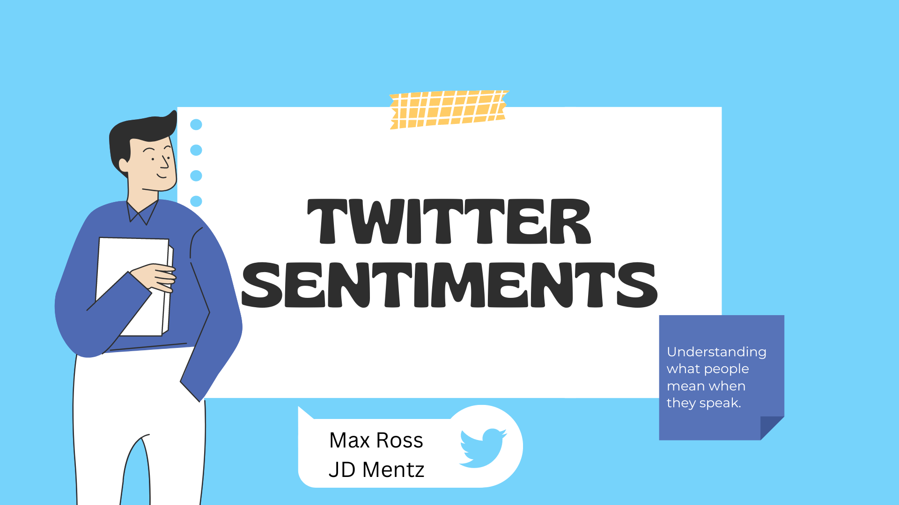
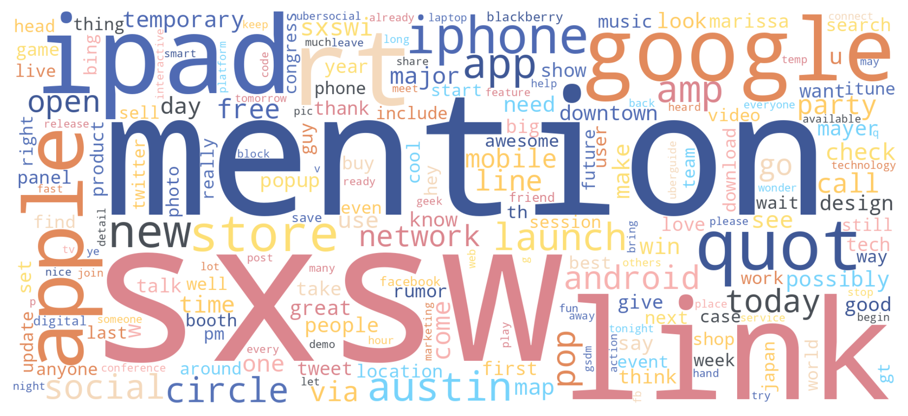
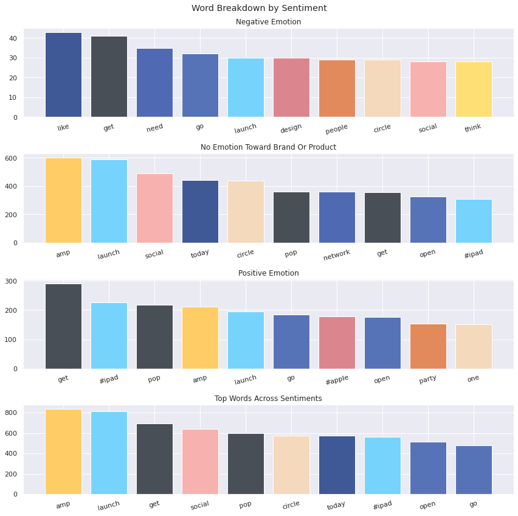
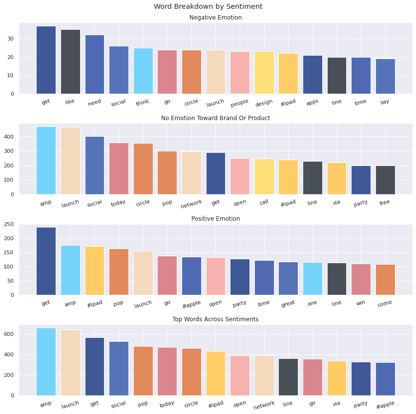
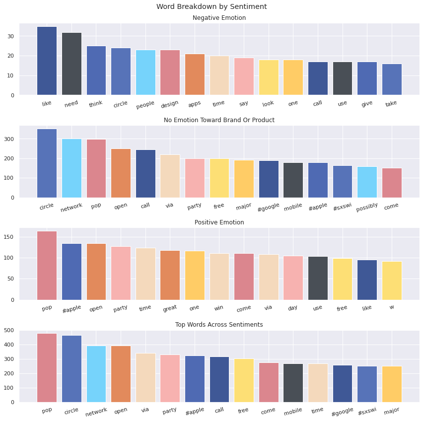
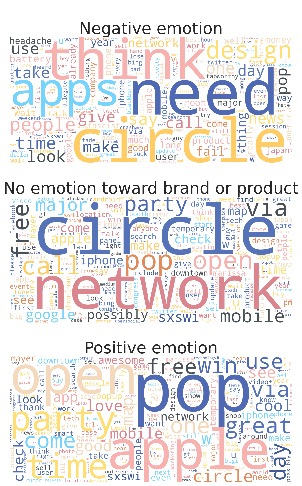
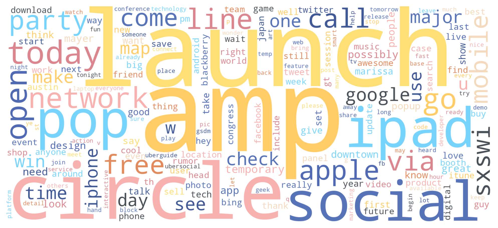
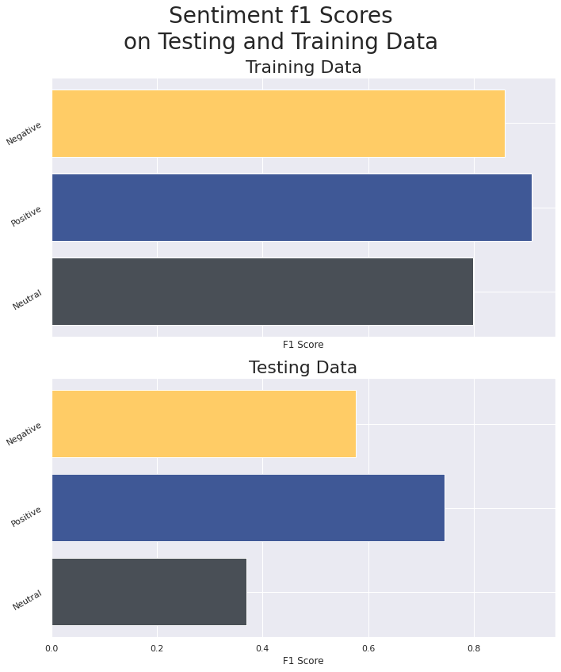
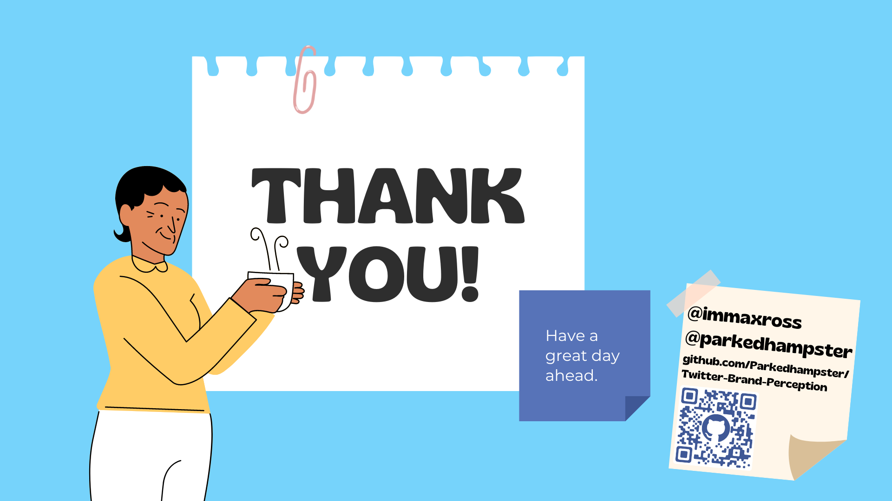

# Twitter Sentiments

------

A deep dive into sentiment analysis from Twitter users
and their perception of certain brands and products. A
project aimed at product managers to increase their
efficiency by making both benefits and issues stand out
directly from the mouths of their customers.



## Goals

------

### Understand

Use the content and meaning of words to evaluate some
part of what's being said in a given tweet; as well -
determine what words can be outright ignored throughout
the process to bring efficiency and strength to the
model at hand.

### Classify

Create a model that is able to correctly classify the
sentiments expressed in any given tweet using the
content within to categorize it as any of positive,
negative, or neutral/no emotion.

### Predict

Take in new tweet information as it becomes available
to utilize a model that can draw conclusions from
existing data to allow product managers to quickly and
efficiently place their focus where it counts.

## Business Case

------

Social media is a powerful tool for connecting with
your customer base.

Customer feedback is critical in the success of both
products and businesses, but often is difficult,
expensive, or unwieldy to collect.

Twitter is frequently a place for people to vent their
frustrations or joys of products and services and is a
mostly-public tool that can be leveraged in our favor
to get a strong overview of what the primary issues may
be, but with unimagineable numbers of tweets being sent
out on a daily, or even hourly basis, gathering the
general sentiment of any number of these tweets is all
but impossible for a team of any size.

It is imperative that this process be automated to the
best of any computer's ability in order to obtain the
most in-depth understanding of a market's emotions.

By categorizing these sentiments, it becomes much more
possible to narrow down to any number of tweets for
review.

## Data Overview

------

This data set was provided by Flatiron School and
sourced through
[data.world](https://data.world/),
provided
[here](https://data.world/crowdflower/brands-and-product-emotions).
The data contains the brand being discussed as well as
general sentiments for each of 9,092 tweets alongside
their original content, as derived by a human.  
These tweets are centered around attendees of the
South by Southwest (SXSW) electronics expo and are
categorized as either negative, positive, or neutral in
regards to the emotions being expressed.

## Examining Our Features & Targets

------

In order to start our process, we need to bring in our
data and verify what's in it. We'll start by loading
the data and checking its output.

| |tweet_text | emotion_in_tweet_is_directed_at | is_there_an_emotion_directed_at_a_brand_or_product |
| --- | --- | --- | ---|
| 9088 | Ipad everywhere. #SXSW {link} | iPad | Positive emotion |
| 9089 | Wave, buzz... RT @mention We interrupt your re... | NaN | No emotion toward brand or product |
| 9090 | Google's Zeiger, a physician never reported po... | NaN | No emotion toward brand or product |
| 9091 | Some Verizon iPhone customers complained their... | NaN | No emotion toward brand or product |
| 9092 | ŒÏ¡ŽÏàŠü_‹Ê‹Î‹Ò‹£‹Á‹â⋁_‹£‹‹â_‹ÛâRT @... | NaN | No emotion toward brand or product |

Our data seems pretty straightforward, there's the
tweet body, what the tweet is directed at, and what
emotion the tweet is expressing. The column names are
really and somewhat confusing. We'll start off by
renaming them to "product" and "sentiment"

As well, it looks like there are some tweets that were
classified as "I can't tell" which won't be very
helpful in our process.

At this point, we'll split off the sentiments listed as
"I can't tell" into their own dataframe and drop them
from the original.

## Preprocessing

For visualization, we'll go ahead and plot out all of
the words that are in the data set into a word cloud so
we can get a good grasp of what our data contains. As
a first step, we'll remove what are known as "stop
words" that don't really hold any meaning on their own.



There seem to be a lot of words repeated a lot of
times, so we'll want to go through and add those words
to list for removal.

Just to see how these tweets will look after removing
the words that don't seem helpful, we'll output the
first five entries here.

```python
['@wesley g hr tweet #rise dead need upgrade plugin station',
'@jessedee know @fludapp awesome likely appreciate design also give free t',
'@swonderlin wait #ipad also sale',
'hope year festival crashy year',
'@sxtxstate great stuff fri marissa mayer tim reilly tech book conference amp matt mullenweg wordpress']
```

Next, we'll take a look at some of the words that are
shared between all of the sentiments.



### Splitting the Data

Since we're starting to take influence from our data
and using that to manipulate models, we want to
split everything into a training set and a testing set.

Here, we'll begin the process of finding and removing
the words that appear frequently across all sentiments.
These words won't be useful in categorizing our data
since they'll have similar weights across the board.



Since we still have words in all of the categories,
we'll repeat this process until we don't. Here's what
our last version of this graph looks like.



Great! No shared words across sentiments in the top
slots.

We'll put up another visual representing the words in
each sentiment to get a decent gauge on what might be
having the most gravity.



It looks like there are a few things shared between
neutral and the other categories but not between all of
the categories. This is still useful since a word that
appears in the neutral and negative sentiments would
be leveraging against it being in positive.

Let's get one more look at our words across all of our
data.



We can see that the word "Circle" appears at a high
volume in every category. Looking through the data,
this is because Google launched a social network called
"Circle" that was a large topic during the SXSW event
that was taking place during the time of our dataset's
collection. It would probably be worth it to go ahead
and drop this.

In order for our models to use the data we have, we
need to turn them into counts and vectors for
processing, so we'll go ahead and run our test data
through the preprocessing step here so that it can be
vectorized at the same time.

We'll use TF-IDF vectorization here to make sure the
counts are properly weighted based on their frequency
across the data set.

## Creating the Models

------

Here, we will try several types of models that are
known to be useful in language processing.

Because of a large imbalance in our data, remember that
our entire data set was ~60% neutral sentiment and only
~6.4% negative sentiment, we'll neet to over-sample the
positive and negative sentiments. For this process, we
are sampling the neutral targets at 50% of the data and
the positive or negative targets as the other 50% at
25% each.

After performing a grid search across models, we found
that the default SMOTE and SVC were our best options.

Here are some of the results of the model predictions.
We'll go ahead and perform this test on both the
training and testing sets.

| Set Used | Neutral F1 | Positive F1 | Negative F1 | Pos/Neg Average | Overall Average |
| ---: | :---: | :---: | :---: | :---: | :---: |
| Training | 79.8% | 90.9% | 85.8% | 88.4% | 85.5% |
| Testing  | 36.9% | 74.5% | 57.6% | 66.1% | 56.3% |

Our predictions on our training data look pretty decent
with our model picking up on around 88% of our positive
and negative values. Unfortunately, that isn't the case
for our testing data. Landing at 66% average on
positive and negative scores and a substantially worse
overall score, there are clearly some issues with what
exactly the model is doing.



Our model may be overfitting, but it still has some
potential.

Let's take a look at something we found earlier -
entries that were marked as "I can't tell."

This isn't really something we can automatically verify
and score against without some extra data entry, but we
can subjectively gauge our model's effectiveness at a
cursory level.

 | Neutral tweets |
|---|
| Looks like the line for the Apple pop-up store on Congress Ave is already down to the end of the block..  #SXSW #SteveJobsWins |
| How can google load those maps so fast, yet I can barely post a tweet haha #sxsw |
| Regardless of keyword - Google thinks local. #mobilesearch #SXSW #SXSWi |
| From #SXSW: @mention says @mention playing with NFC for next gen devices. Nexus S now, iPhone 5 next? |
| RT @mention Win an #OpenBeta6 iPad @mention this #sxsw panel {link}  today @mention 11! #usguys cc @mention  #DgtlTribe #sxswbuffalo |

| Positive tweets |
|---|
| The session #designingforkids is changing my mind about my future kid's relationship with the iPhone. #sapient #sxsw |
| It's funny watching a room full of people hold their iPad in the air to take a photo. Like a room full of tablets staring you down. #SXSW |
| Comprando mi iPad 2 en el #SXSW (@mention Apple Store, SXSW w/ 62 others) {link} |
| Google Circles - looking forward to this. sadly no launch at #SXSW |
| I'll bet there's a lot of nerds at #SXSW using the #iPhone Light Saber app in barroom brawls instead of their fists. |

| Negative tweets |
|---|
| TR @mention Google (tries again) to launch a new social network called Circles: {link} #sxsw {link} |
| The iPad 2 is the also a cartoonishly large digital camera. #SXSW #CStejas {link} |
| Apple is &quot;the classiest, fascist company in America,&quot; says @mention #sxsw |
| @mention RWW: Google Circles will be ______    #sxsw {link} |
| Bet on a GoogleBuzz-like #fail. People don't care about privacy, else they'd quitted FB/TW already RT @mention Google Circles will be __ #sxsw |

Looking at the results here, it's a bit of a mixed bag.
However, there are a handful of tweets above that are
definitely being categorized correctly - which is
impressive considering a human researcher put them in
as "I can't tell." Unfortunately, there are still a
few that seem like they're not categorized correctly.

On the bright side - there are still steps that can be
taken to improve the model.

## Next Steps

To improve our model, we want to investigate a few more
items, including:

1. Analyzing brand information in our dataset to see if
adding context enhances model performance.
2. We will also explore other modeling systems to
achieve better results
3. Consider non-English tweets
4. Implement an updating system that continuously
incorporates new and updated tweets, enabling the model
to adapt to evolving language context.

These steps will, hopefully, enhance the effectiveness
and generalization of our model to better predict tweet
sentiment.

For a reduced version of the process, the README file
is available
[here](./README.md).

Additionally, there is a copy of our presentation
[here, in pdf form](./twitter_sentiment.pdf).

For any questions or business inquiries, Max and JD are
available for contact through github and email.

### Contact Information

| Data Scientist | Github | email|
| ---: | --- | --- |
| JD | [https://github.com/ParkedHampster](https://github.com/ParkedHampster) | [jmentz@gmx.com](mailto:jmentz@gmx.com) |
| Max | [https://github.com/ImMaxRoss](https://github.com/ImMaxRoss) | [max@maxross.com](max@maxross.com) |



### File Structure

```bash
.
├── code
│  ├── __init__.py
│  ├── cleaner.py
│  ├── scoring.py
│  └── viz.py
├── data
│  ├── best_estimator.pkl
│  └── judge-1377884607_tweet_product_company.csv
├── img
│  ├── thank_you.png
│  └── twitter_title.png
├── LICENSE
├── README.md
├── README_files
│  └── #[images specific to the README]
├── scratch
│  ├── code -> ../code
│  ├── data -> ../data
│  └── img -> ../img
└── twitter_sentiment.ipynb
└── twitter_sentiment.pdf
```
